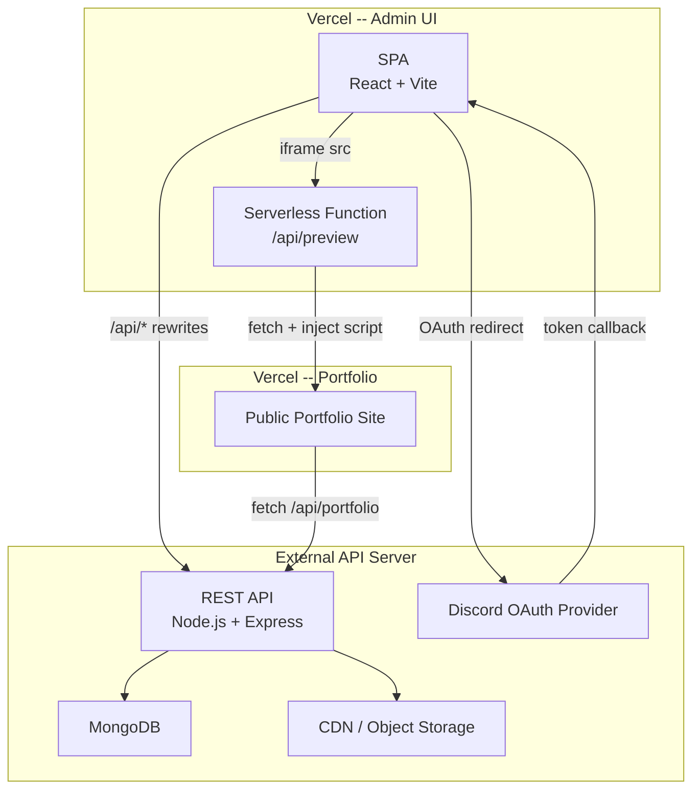
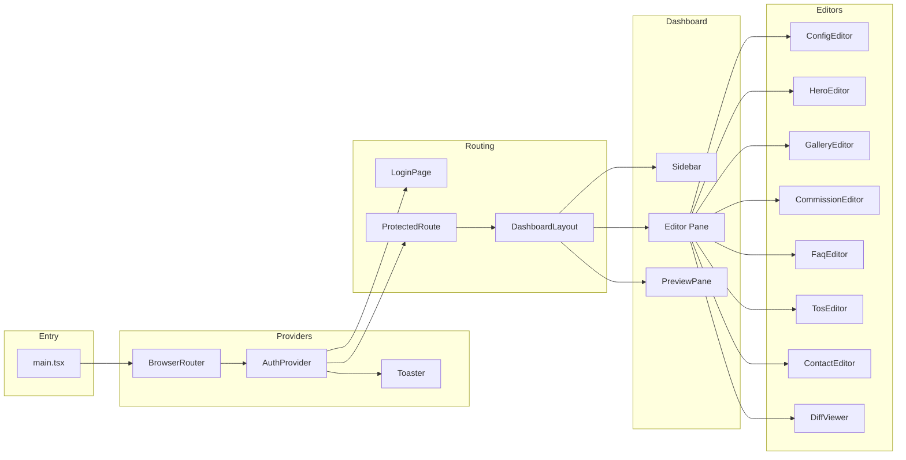
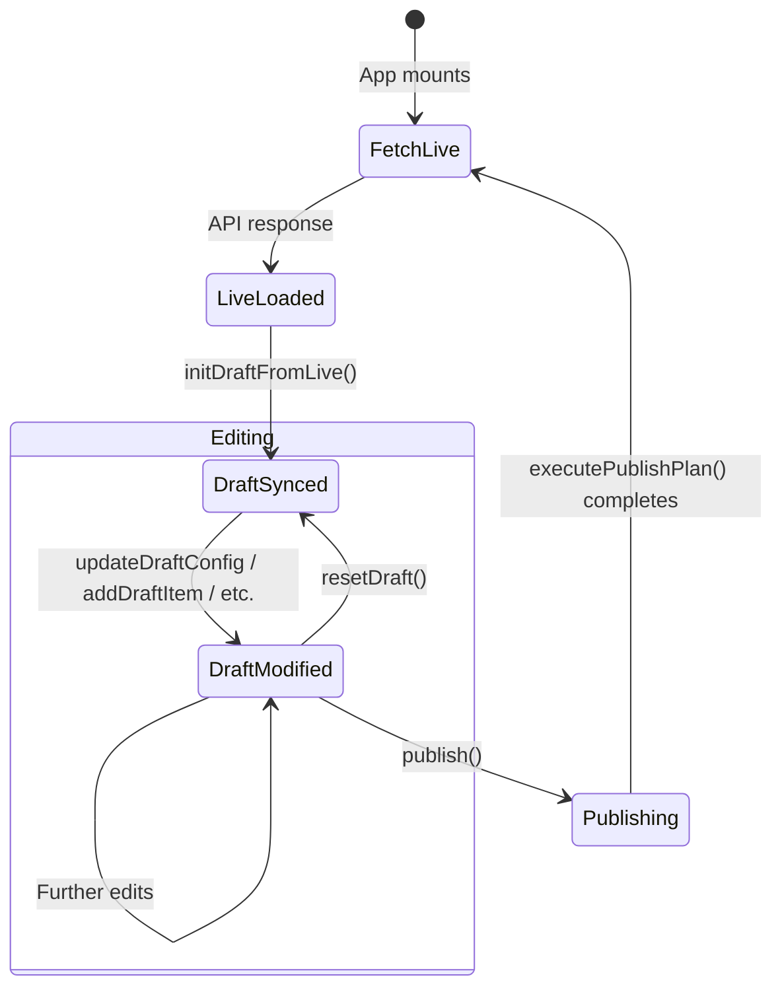
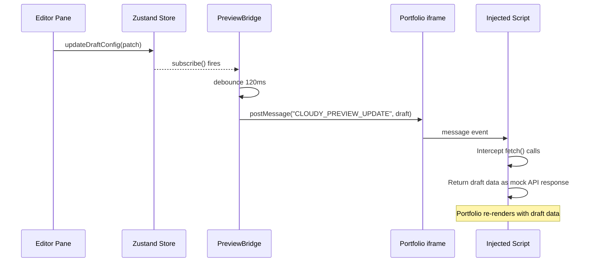
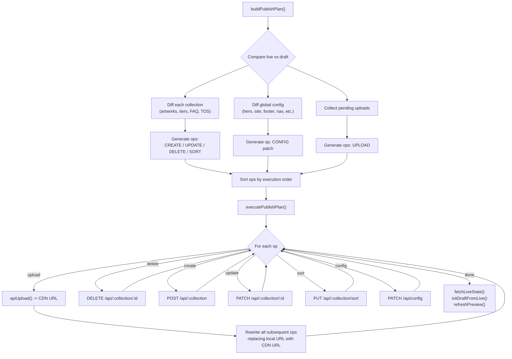
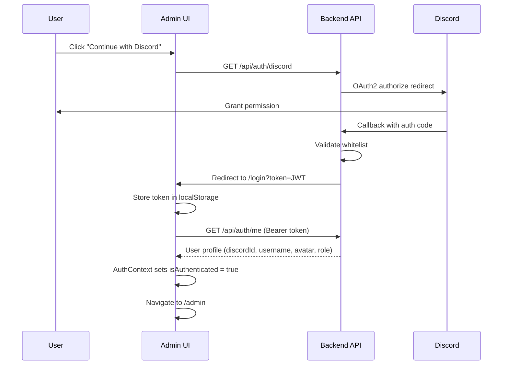

< | [Getting Started](#getting-started) | [Replication Guide](#replication-guide) | [API Reference](#api-reference) | [Testing](#testing)

---

</div>

## Table of Contents

- [Overview](#overview)
- [Architecture](#architecture)
  - [System Architecture](#system-architecture)
  - [Frontend Architecture](#frontend-architecture)
  - [State Management](#state-management)
  - [Live Preview System](#live-preview-system)
  - [Publish Pipeline](#publish-pipeline)
  - [Authentication Flow](#authentication-flow)
- [Technology Stack](#technology-stack)
- [Project Structure](#project-structure)
- [Getting Started](#getting-started)
  - [Prerequisites](#prerequisites)
  - [Local Development](#local-development)
  - [Production Deployment](#production-deployment)
- [Replication Guide](#replication-guide)
  - [Phase 1 -- Foundation](#phase-1----foundation)
  - [Phase 2 -- State Layer](#phase-2----state-layer)
  - [Phase 3 -- Editor System](#phase-3----editor-system)
  - [Phase 4 -- Preview Bridge](#phase-4----preview-bridge)
  - [Phase 5 -- Publish Engine](#phase-5----publish-engine)
  - [Phase 6 -- Deployment](#phase-6----deployment)
- [API Reference](#api-reference)
- [Testing](#testing)
- [Environment Variables](#environment-variables)
- [License](#license)

---

## Overview

Cloudy Admin UI is a purpose-built content management system (CMS) dashboard designed for managing an artist portfolio website. It provides a two-pane editing interface: section-specific editors on the left and an embedded live preview of the public-facing portfolio on the right.

### Core Capabilities

| Capability | Description |
|---|---|
| **Section Editors** | Dedicated editors for Hero, Gallery, Commissions, FAQ, TOS, Contact, and Site Config |
| **Live Preview** | Embedded iframe renders the production portfolio with draft data injected via `postMessage` |
| **Differential Publishing** | Only changed resources are sent to the API -- no full-state overwrites |
| **Optimistic Draft State** | All edits happen in-memory via Zustand; nothing persists until explicit publish |
| **Image Pipeline** | Client-side image selection with deferred CDN upload during publish |
| **Change Tracking** | Git-style diff viewer with per-field rollback and per-section publish |
| **Drag-and-Drop Ordering** | Sortable lists for gallery items, FAQ entries, commission tiers, and TOS sections |
| **Discord OAuth** | Authentication via Discord with role-based whitelisting |
| **Responsive Layout** | Sidebar collapses to hamburger menu on mobile; preview toggles separately |

---

## Architecture

### System Architecture

The following diagram illustrates the full system topology across three deployment targets.



**Key design decisions:**

- The Admin UI never communicates directly with the portfolio. All preview rendering is proxied through a serverless function that injects a `postMessage`-based script into the portfolio HTML.
- API calls from the Admin SPA are proxied via Vite (development) or Vercel rewrites (production) to avoid CORS configuration on the API server.
- The portfolio site remains a fully independent deployment that reads from the same API.

---

### Frontend Architecture



The application uses a flat routing structure with two routes:

| Route | Component | Access |
|---|---|---|
| `/login` | `LoginPage` | Public |
| `/admin` | `DashboardLayout` | Protected (requires authentication) |
| `*` | Redirect to `/admin` | -- |

---

### State Management

All application state flows through a single Zustand store (`useDraftStore`). This store maintains two parallel copies of the portfolio data.



**Store structure:**

| Field | Type | Purpose |
|---|---|---|
| `liveState` | `ApiPortfolioData` | Last-known state from the API (read-only baseline) |
| `draftState` | `ApiPortfolioData` | In-memory working copy that editors mutate |
| `pendingUploads` | `Map<string, PendingUpload>` | Images selected locally but not yet uploaded to CDN |
| `isPublishing` | `boolean` | Lock flag during publish operations |
| `publishProgress` | `{current, total, label}` | Step-by-step progress for the publish pipeline |
| `previewKey` | `number` | Incremented to force iframe reload after publish |

**Key selectors** are exported for performant component subscriptions:

```typescript
selectLiveState, selectDraftState, selectIsPublishing,
selectPublishProgress, selectPreviewKey,
selectDraftArtworks, selectDraftCommissionTiers,
selectDraftFaqItems, selectDraftTosSections
```

---

### Live Preview System

The preview system uses a three-layer architecture to render the production portfolio with draft data without requiring a separate preview build.



**How the preview injection works:**

1. **Proxy layer**: In development, a Vite plugin (`portfolioPreviewPlugin`) starts an HTTP server on port 5176. In production, a Vercel serverless function (`/api/preview`) serves the same role.

2. **Script injection**: Both proxy layers fetch the live portfolio HTML and inject a `<script>` tag into `<head>`. This script:
   - Monkey-patches `window.fetch` to intercept calls to the portfolio API endpoint.
   - Listens for `CLOUDY_PREVIEW_UPDATE` messages and stores draft data.
   - Returns draft data as a synthetic `Response` object when the portfolio fetches its data.
   - Signals readiness back to the parent via `CLOUDY_PREVIEW_READY`.

3. **Bridge hook** (`usePreviewBridge`): Subscribes to Zustand store changes, debounces updates, and posts draft data to the iframe. Handles iframe reload, reconnection, and cache invalidation.

---

### Publish Pipeline

The publish engine implements a differential sync strategy that computes the minimal set of API mutations required to bring the live state in line with the draft state.



**Execution order** (enforced by the engine):

1. **Uploads** -- Images must resolve to CDN URLs before any create/update ops reference them.
2. **Deletes** -- Remove items first to avoid sort-order conflicts.
3. **Creates** -- New items added to collections.
4. **Updates** -- Modified items patched in place.
5. **Sorts** -- Reorder operations applied after all items exist.
6. **Config** -- Global configuration patched last.

After all operations complete, the store automatically re-fetches live state, resets the draft, and triggers a preview refresh.

---

### Authentication Flow



The `AuthProvider` context wraps the entire application and:
- Calls `/api/auth/me` on mount to check for an existing session.
- Exposes `isAuthenticated`, `isLoading`, and `logout` to all descendants.
- The `ProtectedRoute` component redirects unauthenticated users to `/login`.

---

## Technology Stack

| Category | Technology | Version | Purpose |
|---|---|---|---|
| **Framework** | React | 19.x | Component rendering |
| **Language** | TypeScript | 6.x | Type safety |
| **Build Tool** | Vite | 8.x | Dev server, HMR, bundling |
| **State** | Zustand | 5.x | Global state management with devtools |
| **Routing** | React Router DOM | 7.x | Client-side routing |
| **Drag & Drop** | dnd-kit | 6.x / 10.x | Sortable list reordering |
| **Icons** | Phosphor Icons | 2.x | Consistent icon system |
| **Notifications** | react-hot-toast | 2.x | Toast notifications |
| **Testing** | Vitest + Testing Library | 4.x / 16.x | Unit and component testing |
| **Hosting** | Vercel | -- | SPA hosting + serverless functions |

---

## Project Structure

```
CloudyAdminUI/
|-- api/
|   |-- preview.js              # Vercel serverless function for preview proxy
|-- public/
|   |-- favicon.svg
|-- src/
|   |-- components/
|   |   |-- ActionButton.tsx     # Reusable button with loading/variant states
|   |   |-- ConfirmDialog.tsx    # Modal confirmation dialog
|   |   |-- EditorCard.tsx       # Section wrapper card for editors
|   |   |-- FormField.tsx        # Text input, textarea with diff indicators
|   |   |-- IconPicker.tsx       # Phosphor icon search and selection
|   |   |-- ImageUploader.tsx    # File picker with preview and pending upload
|   |   |-- PreviewPane.tsx      # Viewport-switchable iframe preview
|   |   |-- ProtectedRoute.tsx   # Auth guard wrapper
|   |   |-- Sidebar.tsx          # Navigation sidebar with user profile
|   |   |-- SortableList.tsx     # dnd-kit powered drag-and-drop list
|   |-- config/
|   |   |-- api.ts               # API client (apiFetch, apiUpload, auth headers)
|   |-- context/
|   |   |-- AuthContext.tsx       # Discord OAuth session provider
|   |   |-- PreviewContext.tsx    # Legacy preview context (superseded by store)
|   |-- data/
|   |   |-- defaultPortfolio.ts  # Fallback portfolio data for offline/new setups
|   |-- editors/
|   |   |-- ConfigEditor.tsx     # Branding, nav, socials, footer
|   |   |-- HeroEditor.tsx       # Hero section content and CTA buttons
|   |   |-- GalleryEditor.tsx    # Artwork CRUD with image upload
|   |   |-- CommissionEditor.tsx # Commission tier management
|   |   |-- FaqEditor.tsx        # FAQ item CRUD
|   |   |-- TosEditor.tsx        # Terms of service sections
|   |   |-- ContactEditor.tsx    # Contact form and info card config
|   |   |-- DiffViewer.tsx       # Git-style change review with rollback
|   |-- hooks/
|   |   |-- useApiData.ts        # Generic fetch hook with loading/error states
|   |   |-- useDiff.ts           # Per-field and per-item diff status computation
|   |   |-- useDraftState.ts     # Local draft state hook (field-level updates)
|   |   |-- usePreviewEmitter.ts # Legacy preview emitter (superseded by bridge)
|   |   |-- usePublish.ts        # Publish orchestration hook
|   |-- lib/
|   |   |-- draftImageHandler.ts # Client-side image handling and data URL conversion
|   |   |-- previewBridge.ts     # PostMessage bridge between store and preview iframe
|   |   |-- publishEngine.ts     # Differential publish plan builder and executor
|   |-- pages/
|   |   |-- DashboardLayout.tsx  # Main dashboard with sidebar, editor, and preview
|   |   |-- LoginPage.tsx        # Animated starfield login with Discord OAuth
|   |-- store/
|   |   |-- useDraftStore.ts     # Central Zustand store (live/draft state machine)
|   |-- test/
|   |   |-- setup.ts             # Global test setup (jsdom, mocks, polyfills)
|   |   |-- unit/                # 21 unit test files
|   |-- types/
|   |   |-- api.ts               # TypeScript type definitions for all API entities
|   |-- App.tsx                  # Route definitions
|   |-- main.tsx                 # React root with providers
|   |-- index.css                # Global styles and design tokens
|-- index.html                   # HTML entry point with font preconnects
|-- package.json
|-- vite.config.ts               # Vite config with API proxy and preview plugin
|-- vitest.config.ts             # Vitest config (jsdom, globals, setup file)
|-- vercel.json                  # Production rewrite rules
|-- tsconfig.json                # TypeScript project references
```

---

## Getting Started

### Prerequisites

- **Node.js** 20.x or later
- **npm** 10.x or later
- A running instance of the Cloudy Admin API (or compatible REST backend)
- Discord OAuth application credentials configured on the API server

### Local Development

```bash
# 1. Clone the repository
git clone <repository-url>
cd CloudyAdminUI

# 2. Install dependencies
npm install

# 3. Start the development server
npm run dev
```

The dev server starts on `http://localhost:5174` with:
- API proxy forwarding `/api/*` to `https://cloudyadminapi.azaken.com`
- Preview proxy on `http://localhost:5176` serving the portfolio with injected preview script

### Available Scripts

| Script | Command | Description |
|---|---|---|
| `dev` | `npm run dev` | Start Vite dev server with HMR |
| `build` | `npm run build` | TypeScript check + production bundle |
| `preview` | `npm run preview` | Serve the production build locally |
| `test` | `npm run test` | Run all unit tests once |
| `test:watch` | `npm run test:watch` | Run tests in watch mode |
| `lint` | `npm run lint` | Run ESLint across the project |

### Production Deployment

The application is configured for deployment on Vercel.

```bash
# Build for production
npm run build

# The output is in ./dist
# Deploy via Vercel CLI or Git integration
```

**Vercel configuration** (`vercel.json`):

| Rewrite Rule | Target | Purpose |
|---|---|---|
| `/api/preview/:path*` | `/api/preview` (serverless) | Portfolio preview proxy |
| `/api/:path*` | `https://cloudyadminapi.azaken.com/api/:path*` | API proxy |
| `/(.*)`| `/index.html` | SPA fallback |

---

## Replication Guide

This section provides a step-by-step guide for building a similar CMS framework for any content-driven website.

### Phase 1 -- Foundation

**Goal:** Scaffold a React + TypeScript + Vite project with authentication.

1. **Initialize the project:**
   ```bash
   npx -y create-vite@latest ./ --template react-ts
   npm install react-router-dom zustand react-hot-toast @phosphor-icons/react
   npm install -D vitest @testing-library/react @testing-library/jest-dom jsdom
   ```

2. **Define your API types** in `src/types/api.ts`. Model every entity your public site consumes. Use a single union type for the complete data payload:
   ```typescript
   export type PortfolioData = GlobalConfig & {
     artworks: Artwork[]
     commissionTiers: CommissionTier[]
     // ... other collections
   }
   ```

3. **Create the API client** in `src/config/api.ts`. Implement a generic `apiFetch<T>()` that:
   - Prepends a base path (`/api`)
   - Attaches auth headers from `localStorage`
   - Unwraps a standard `{ success, data, error }` envelope
   - Redirects to `/login` on 401/403 responses

4. **Implement Discord OAuth** via `AuthContext`. On mount, call `/api/auth/me`. Wrap the app in `AuthProvider` and gate routes with a `ProtectedRoute` component.

5. **Configure Vite proxy** to forward `/api/*` to your backend, avoiding CORS during development.

### Phase 2 -- State Layer

**Goal:** Build the central Zustand store that holds live and draft state.

1. **Create `useDraftStore`** with two parallel state trees:
   - `liveState` -- fetched from the API, treated as read-only.
   - `draftState` -- cloned from live, mutated by editors.

2. **Implement CRUD actions** on the store:
   - `updateDraftConfig(patch)` -- shallow merge for global config
   - `addDraftItem(collection, item)` -- append to collection array
   - `updateDraftItem(collection, id, patch)` -- patch by ID
   - `removeDraftItem(collection, id)` -- filter by ID
   - `reorderDraftItems(collection, items)` -- replace with reordered array

3. **Track pending uploads** with a `Map<localUrl, { file }>`. Use `URL.createObjectURL()` or data URLs for immediate preview; resolve to CDN URLs during publish.

4. **Add a dirty check**: `isDirty()` compares `JSON.stringify(liveState)` vs `JSON.stringify(draftState)`.

5. **Provide default/fallback data** in `src/data/defaultPortfolio.ts` so the UI works offline. Use a `mergeWithDefaults()` function to fill gaps in API responses.

### Phase 3 -- Editor System

**Goal:** Build section-specific editors that read from and write to the Zustand store.

1. **Create reusable components:**
   - `FormField` -- text inputs and textareas with optional diff indicator styling
   - `EditorCard` -- collapsible section wrapper with title, description, and icon
   - `ImageUploader` -- file picker that creates pending uploads
   - `IconPicker` -- searchable icon selector
   - `SortableList` -- dnd-kit powered drag-and-drop reordering
   - `ActionButton` -- button with loading spinner, variant, and size props

2. **Implement each editor** (ConfigEditor, HeroEditor, GalleryEditor, etc.):
   - Hydrate local state from the Zustand draft on mount (using a `hydratedRef` guard)
   - Push changes back to the store via `useEffect` on local state changes
   - Use `useDiff()` to show per-field change indicators

3. **Build the DiffViewer** as a change review screen:
   - Compare live vs. draft across all config paths and collections
   - Group changes by section
   - Provide per-change rollback and per-section publish buttons

### Phase 4 -- Preview Bridge

**Goal:** Render the live public site with draft data injected in real time.

1. **Create a proxy** that fetches the public site HTML and injects a script:
   - Dev: Vite plugin with `configureServer()` hook starting an HTTP server
   - Production: Serverless function (e.g., Vercel, AWS Lambda)

2. **Write the injection script** that:
   - Monkey-patches `window.fetch` to intercept API calls
   - Listens for `postMessage` events with draft data
   - Returns synthetic `Response` objects containing draft data
   - Signals readiness back to the parent frame

3. **Implement `usePreviewBridge`** hook:
   - Subscribe to Zustand store changes
   - Debounce updates (120ms recommended)
   - Post draft data to iframe via `contentWindow.postMessage()`
   - Handle iframe reload with exponential retry attempts

4. **Add viewport switching** in `PreviewPane` (desktop/tablet/mobile widths).

### Phase 5 -- Publish Engine

**Goal:** Compute and execute the minimal set of API mutations.

1. **Build the diff algorithm** (`buildPublishPlan`):
   - For each collection: identify added (draft IDs), removed (missing from draft), and modified items
   - For global config: compare each top-level key
   - For uploads: include all pending images
   - Sort operations by execution order: uploads, deletes, creates, updates, sorts, config

2. **Implement `executePublishPlan`:**
   - Iterate operations sequentially
   - After each upload resolves, rewrite all subsequent operations to replace local URLs with CDN URLs
   - Report progress via `setPublishing(true, { current, total, label })`
   - On completion: re-fetch live state, reset draft, refresh preview

3. **Support per-section publish** by filtering the full plan to only operations belonging to a specific collection or config scope.

### Phase 6 -- Deployment

**Goal:** Deploy to a hosting platform with serverless function support.

1. **Configure rewrites** (e.g., `vercel.json`):
   - Preview proxy route to serverless function
   - API routes to backend server
   - SPA fallback for client-side routing

2. **Set environment variables** for the portfolio URL and API base.

3. **Verify CORS**: Since API calls are proxied through rewrites, the browser never makes cross-origin requests. The API server only needs to allow the admin domain.

---

## API Reference

The Admin UI communicates with the backend through the following endpoints. All requests are proxied through `/api` and include a Bearer token in the `Authorization` header.

### Authentication

| Method | Endpoint | Description |
|---|---|---|
| GET | `/api/auth/discord` | Initiate Discord OAuth flow |
| GET | `/api/auth/me` | Return current authenticated user |
| POST | `/api/auth/logout` | Invalidate session |

### Portfolio Data

| Method | Endpoint | Description |
|---|---|---|
| GET | `/api/portfolio` | Fetch complete portfolio state |
| PATCH | `/api/config` | Update global configuration |

### Collections (artworks, commissions, faqs, tos)

| Method | Endpoint | Description |
|---|---|---|
| POST | `/api/:collection` | Create new item |
| PATCH | `/api/:collection/:id` | Update existing item |
| DELETE | `/api/:collection/:id` | Delete item |
| PUT | `/api/:collection/sort` | Reorder items |

### File Upload

| Method | Endpoint | Description |
|---|---|---|
| POST | `/api/upload` | Upload image (multipart/form-data) |

**Response envelope format:**

```json
{
  "success": true,
  "data": { ... },
  "error": { "code": "...", "message": "..." }
}
```

---

## Testing

The project includes 21 unit test files covering stores, hooks, components, and pages.

```bash
# Run all tests
npm run test

# Run in watch mode
npm run test:watch
```

### Test Coverage

| Category | Files | What is Tested |
|---|---|---|
| **Store** | `useDraftStore.test.ts` | CRUD operations, dirty detection, fetch/reset |
| **Publish** | `publishEngine.test.ts`, `publishExecution.test.ts`, `usePublish.test.tsx` | Plan building, operation execution, URL rewriting |
| **Hooks** | `useDiff.test.ts`, `usePreviewBridge.test.ts` | Diff status, postMessage debouncing |
| **API** | `api.test.ts` | Fetch wrapper, auth headers, error handling |
| **Components** | `Sidebar.test.tsx`, `PreviewPane.test.tsx`, `IconPicker.test.tsx` | Render, interaction, state reflection |
| **Editors** | `ConfigEditor.test.tsx`, `HeroEditor.test.tsx`, `GalleryEditor.test.tsx`, `CommissionEditor.test.tsx`, `FaqEditor.test.tsx`, `ContactEditor.test.tsx`, `DiffViewer.test.tsx` | Hydration, field updates, diff indicators |
| **Pages** | `LoginPage.test.tsx`, `DashboardLayout.test.tsx`, `AppAndProtectedRoute.test.tsx`, `AuthContext.test.tsx` | OAuth flow, protected routing, auth state |

### Test Configuration

- **Environment**: jsdom
- **Setup file**: `src/test/setup.ts` (mocks for `matchMedia`, `requestAnimationFrame`, Canvas 2D context, `HTMLDialogElement`)
- **Globals**: Enabled (no explicit imports for `describe`, `it`, `expect`)

---

## Environment Variables

| Variable | Default | Context | Description |
|---|---|---|---|
| `VITE_PORTFOLIO_URL` | `https://cloudy.azaken.com` | Build-time | Base URL of the public portfolio site |
| `MODE` | `development` | Vite | Controls preview URL (localhost vs. serverless) |

---

## License

This project is private and not licensed for redistribution.
]]>
